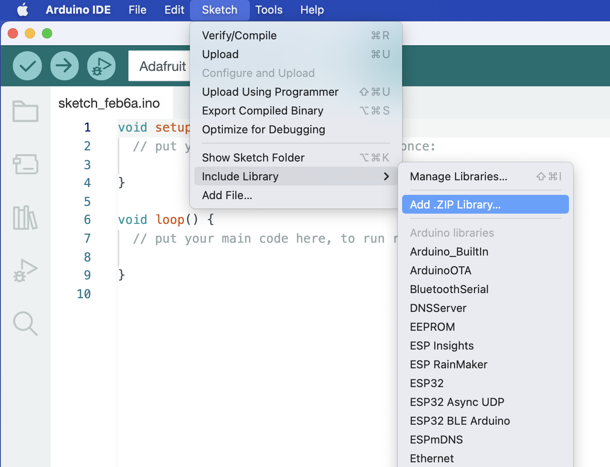

# MSE2202_Lib

Arduino library for use with MSEduino and MSEbot used in MSE 2202 at Western University. Provides functions for controlling drive motors with integrated encoders and reading signals from an infrared beacon.

## Installation

1. Click the Code button and then select Download .ZIP.

2. Install the library from the Arduino IDE using the Sketch→Include Library→Add .ZIP library... menu item, as shown below.

    

3. If upgrading from an older version, you will be asked whether you want to overwrite the existing library. Select YES.

    

Alternatively, the files can be downloaded and the unzipped folder can be placed in your Arduino/libraries folder manually. If you have git installed, you can also clone the repository to this location. 